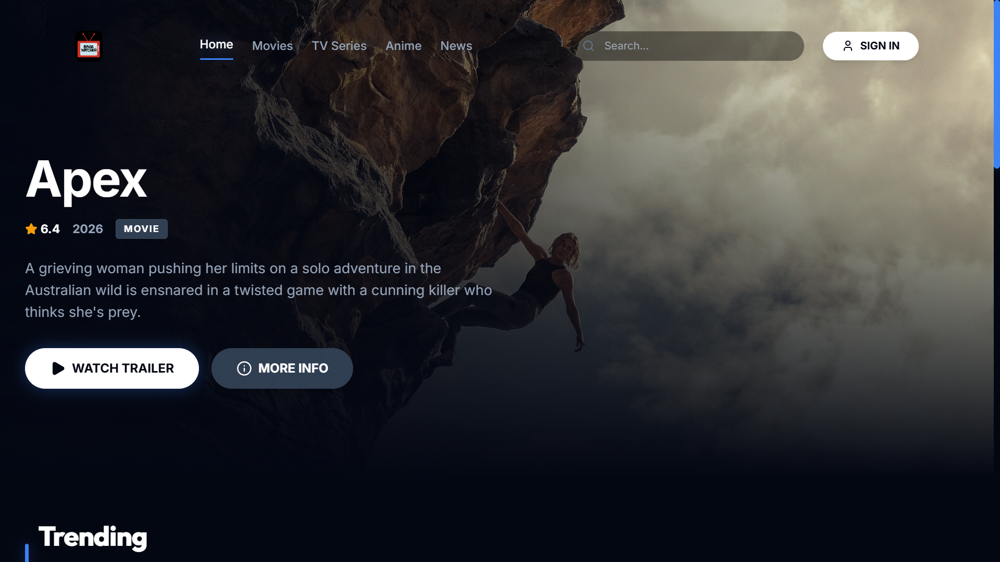
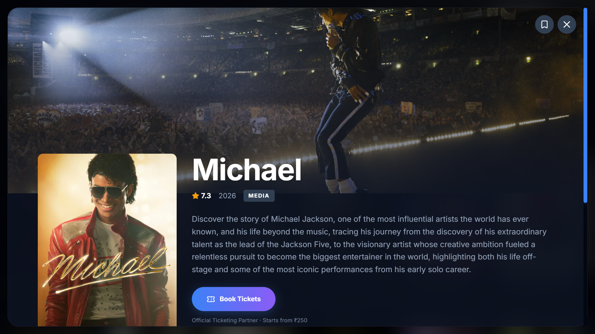
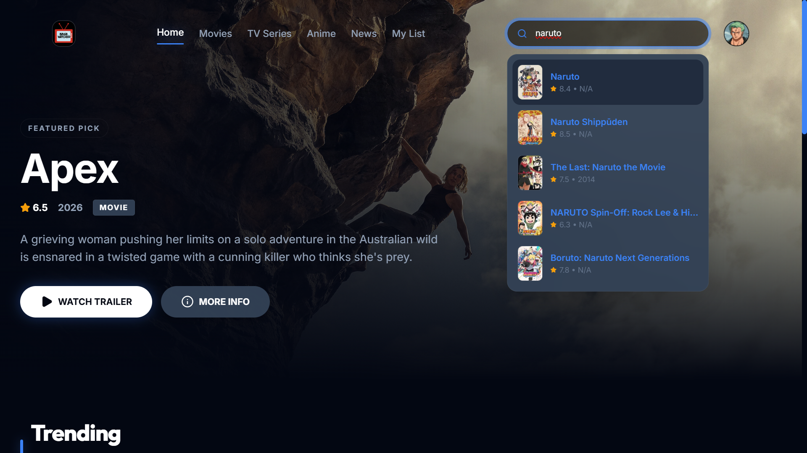
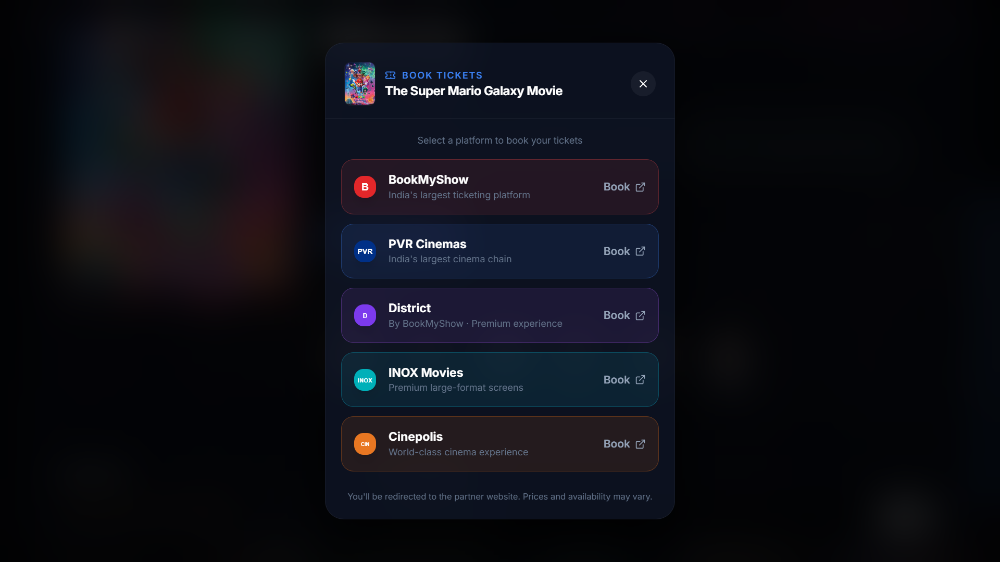
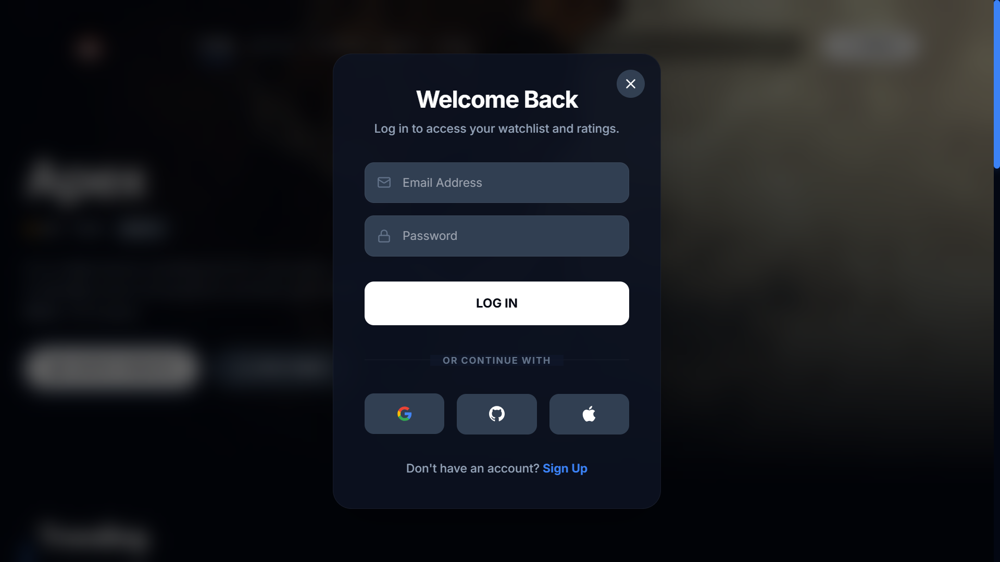

# 🎬 BingeWatch — Ultimate Media Hub

BingeWatch is a premium, high-performance web application designed for movie enthusiasts, anime fans, and binge-watchers. It provides a sleek, minimalist "BingeWatch" aesthetic with a deep-slate glassmorphic UI, real-time data fetching, and seamless external integrations.


## ✨ Key Features

### 🚀 Advanced Discovery
- **Real-time Search Suggestions:** Instant feedback as you type with poster previews and ratings.
- **Smart Genre Filtering:** Dynamic chip-based filtering that adapts to Movies, TV Series, and Anime.
- **News & Upcoming:** Stay ahead of the curve with the latest releases and trailers.

### 🎟️ Ticketing & Booking
- **Partner Integration:** Direct deep-links to major ticketing platforms including **BookMyShow, PVR, Inox, and Cinepolis**.
- **Smart Booking Logic:** The "Book Ticket" feature intelligently appears only for new and upcoming movies within a valid release window.

### 👤 Personalized Experience
- **Firebase Authentication:** Secure sign-in via Google, GitHub, Apple, or Email.
- **Cloud Watchlist:** Save your favorite titles to your personal list (synchronized via Firestore).
- **Interactive Ratings:** Rate titles and leave comments to share your thoughts.

### 💎 Premium Design
- **BingeWatch Aesthetic:** A flat, modern UI with high border-radii, glassmorphic surfaces, and a curated Slate color palette.
- **Framer Motion Animations:** Fluid transitions, spring-loaded modals, and breathing background effects.
- **Responsive Layout:** Optimized for everything from mobile phones to ultra-wide monitors.

## 🛠️ Tech Stack

- **Frontend:** [React 19](https://react.dev/), [Vite](https://vitejs.dev/)
- **Styling:** [Tailwind CSS](https://tailwindcss.com/)
- **Animations:** [Framer Motion](https://www.framer.com/motion/)
- **Icons:** [Lucide React](https://lucide.dev/)
- **Backend/Auth:** [Firebase](https://firebase.google.com/) (Auth, Firestore)
- **Data Source:** [TMDB API](https://www.themoviedb.org/documentation/api) & [Jikan API](https://jikan.moe/)

## 🚀 Getting Started

### 1. Clone the repository
```bash
git clone https://github.com/manavv09/Analyzer.git
cd Movie-Series-Stats
```

### 2. Install dependencies
```bash
npm install
```

### 3. Environment Setup
Create a `.env` file in the root directory and add your API keys:
```env
VITE_TMDB_API_KEY=your_tmdb_key_here
VITE_FIREBASE_API_KEY=your_firebase_key
VITE_FIREBASE_AUTH_DOMAIN=your_project.firebaseapp.com
VITE_FIREBASE_PROJECT_ID=your_project_id
VITE_FIREBASE_STORAGE_BUCKET=your_project.appspot.com
VITE_FIREBASE_MESSAGING_SENDER_ID=your_sender_id
VITE_FIREBASE_APP_ID=your_app_id
```

### 4. Run Development Server
```bash
npm run dev
```

## Deploy on Vercel

This project is configured for SPA routing on Vercel using `vercel.json`.

1. Push your code to GitHub.
2. Import the repository in [Vercel](https://vercel.com/new).
3. Add the same environment variables from your local `.env` file in Vercel Project Settings.
4. Deploy.

Vercel will automatically use:
- Build command: `npm run build`
- Output directory: `dist`

## 📸 Screenshots

| Home Dashboard | Movie Details |
| :---: | :---: |
|  |  |

| Search Suggestions | Booking Integration |
| :---: | :---: |
|  |  |

| Authentication UI |
| :---: |
|  |

---
Developed with ❤️ by [Manav R.Bharti](https://github.com/manavv09)
