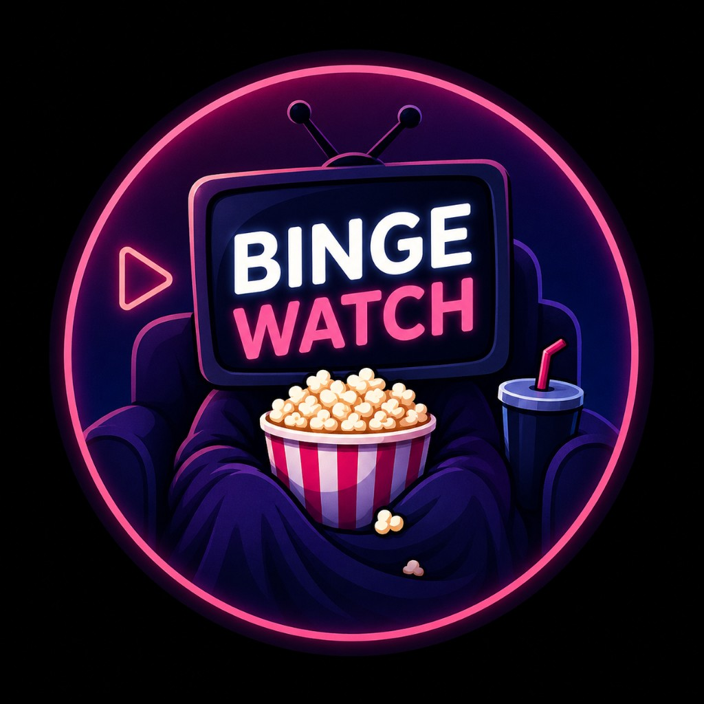
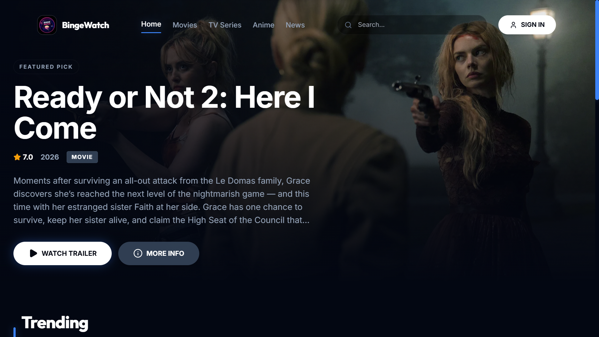
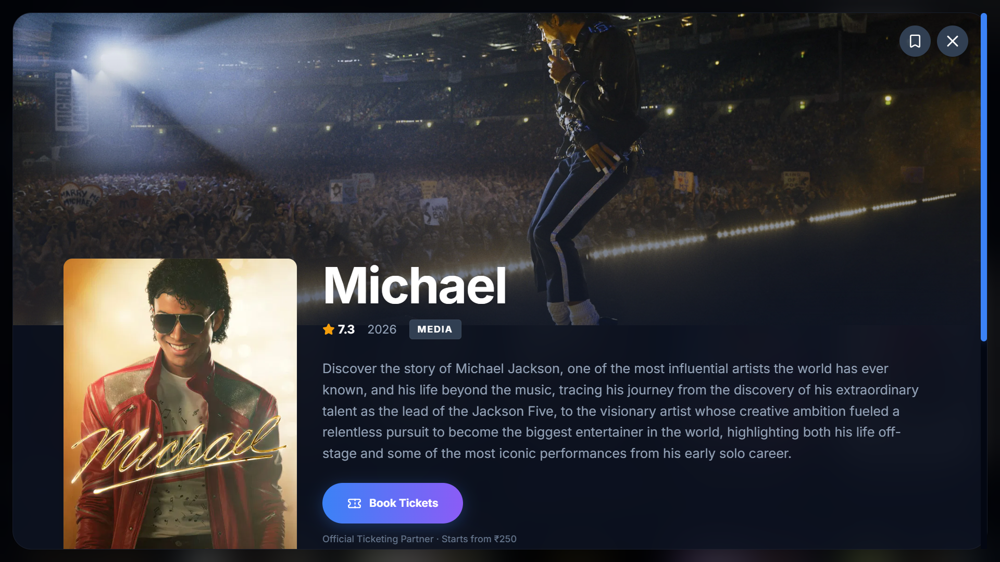
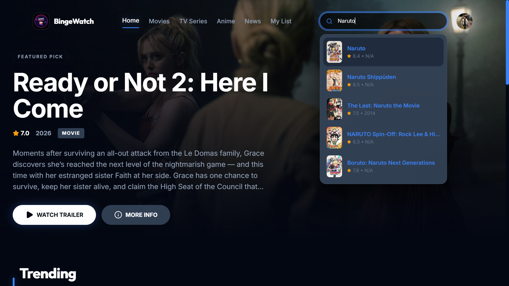
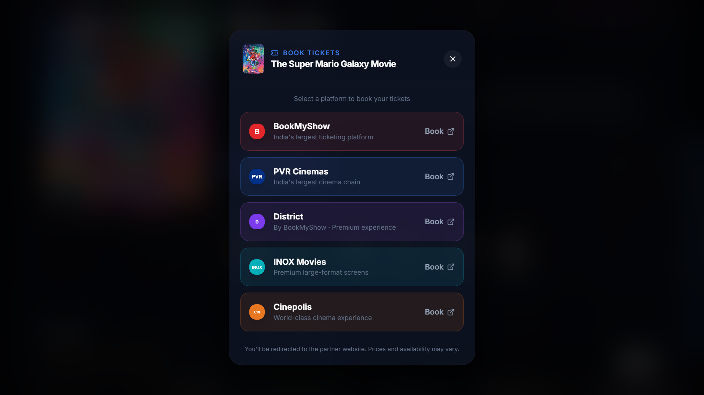
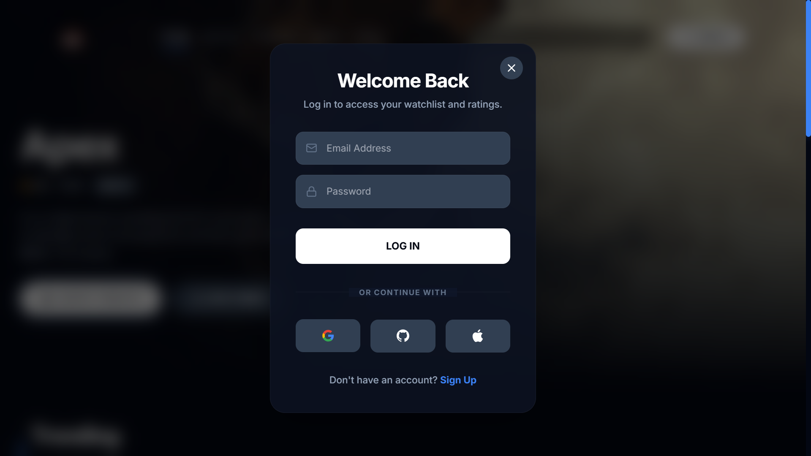
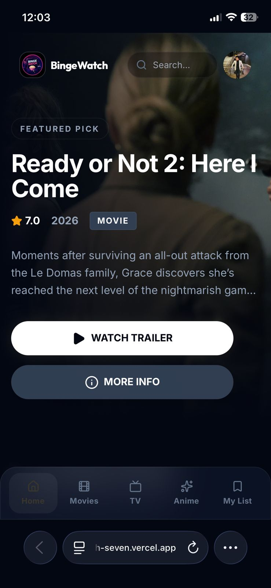
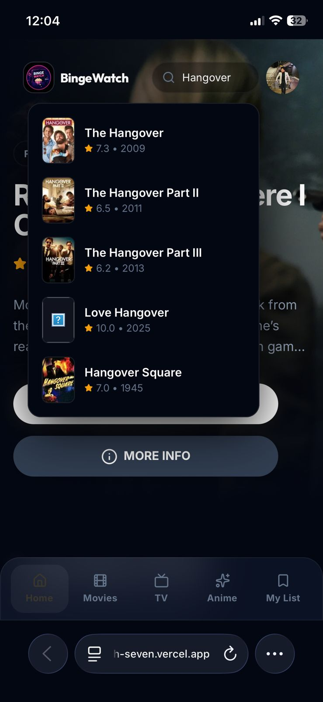

<div align="center">
  

  # 🎬 BingeWatch — Ultimate Media Hub

  **A premium, high-performance web application designed for movie enthusiasts, anime fans, and binge-watchers.**

  [](https://react.dev/)
  [](https://vitejs.dev/)
  [](https://tailwindcss.com/)
  [](https://firebase.google.com/)
  [](https://www.framer.com/motion/)
</div>

<br />


BingeWatch is a front-end masterpiece built to demonstrate senior-level React architecture. It features a sleek, minimalist "tech dashboard" aesthetic with a deep-slate glassmorphic UI, real-time data fetching from multiple REST APIs, and hardware-accelerated animations.

---

## ✨ Key Features

### 🚀 Advanced Discovery & UI
- **Dynamic Hero Carousel:** An auto-playing, GPU-accelerated carousel showcasing the top 10 trending movies, series, and anime.
- **Real-time Search Suggestions:** Instant feedback as you type with poster previews and ratings.
- **Smart Genre Filtering:** Dynamic chip-based filtering that adapts to Movies, TV Series, and Anime seamlessly.
- **News & Upcoming:** Stay ahead of the curve with the latest global releases and high-definition trailers.

### 🎟️ Ticketing & Streaming Integration
- **OTT Availability:** Instantly see where to stream titles (Netflix, Prime Video, Disney+, Crunchyroll) using real-time JustWatch data.
- **Partner Integration:** Direct deep-links to major ticketing platforms including **BookMyShow, PVR, Inox, and Cinepolis**.
- **Smart Booking Logic:** The "Book Ticket" feature intelligently appears only for new and upcoming movies within a valid 90-day release window.

### 👤 Personalized Experience
- **Firebase Authentication:** Secure, robust sign-in via Google, GitHub, Apple, or Email.
- **Cloud Watchlist:** Save your favorite titles to your personal list (synchronized instantly via Firestore).
- **Interactive Ratings:** Rate titles and leave comments to share your thoughts with the community.

---

## ⚡ Engineering & Performance (Portfolio Highlights)

This project was engineered with a strict focus on performance, scalability, and edge-case handling:

- **Custom Image Lazy Loading:** Implemented a bespoke `<LazyImage />` component utilizing native `IntersectionObserver` with skeleton blur-up animations to prevent layout shifts and drastically improve Google Lighthouse scores.
- **Infinite Scrolling:** Seamlessly load new pages of movies and anime as you scroll down, utilizing zero-dependency Intersection Observers for a native app-like experience.
- **Algorithmic Color Extraction:** Integrates `fast-average-color` to asynchronously analyze movie posters and dynamically change the application's entire global CSS accent colors (buttons, glows, borders) in real-time without blocking the main thread.
- **CORS Cache-Busting:** Custom JavaScript logic to bypass browser cache-poisoning when fetching cross-origin images for canvas pixel manipulation.
- **Dynamic Content Scaling:** Built custom responsive layouts that elegantly scale typographies, line-heights, and flex containers based on exact device viewport sizes (from 320px mobile to ultra-wide monitors).
- **Hardware Acceleration:** Strategic use of `will-change: transform, opacity` and `AnimatePresence` to offload heavy cross-fade rendering to the GPU, guaranteeing 60fps animations.

---

## 🛠️ Tech Stack

- **Frontend Core:** React 19, Vite
- **Styling:** Tailwind CSS (Custom Design System)
- **Animations:** Framer Motion
- **Icons:** Lucide React
- **Backend/Auth:** Google Firebase (Authentication, Cloud Firestore)
- **Data Sources:** TMDB API (Movies/TV) & Jikan API (Anime)

---

## 🚀 Getting Started

### 1. Clone the repository
```bash
git clone https://github.com/manavv09/Analyzer.git
cd Movie-Series-Stats
```

### 2. Install dependencies
```bash
npm install
```

### 3. Environment Setup
Create a `.env` file in the root directory and add your API keys:
```env
VITE_TMDB_API_KEY=your_tmdb_key_here
VITE_FIREBASE_API_KEY=your_firebase_key
VITE_FIREBASE_AUTH_DOMAIN=your_project.firebaseapp.com
VITE_FIREBASE_PROJECT_ID=your_project_id
VITE_FIREBASE_STORAGE_BUCKET=your_project.appspot.com
VITE_FIREBASE_MESSAGING_SENDER_ID=your_sender_id
VITE_FIREBASE_APP_ID=your_app_id
```

### 4. Run Development Server
```bash
npm run dev
```

---

## 📸 Screenshots

| Home Dashboard | Movie Details |
| :---: | :---: |
|  |  |

| Search Suggestions | Booking Integration |
| :---: | :---: |
|  |  |

| Authentication UI |
| :---: |
|  |

## 📱 Mobile UI Experience

BingeWatch is fully responsive and provides an app-like experience on mobile devices with a custom bottom navigation bar, touch-friendly swiping carousels, and an optimized mobile search flow.

| Mobile Home | Mobile Search |
| :---: | :---: |
|  |  |

---
<div align="center">
  <b>Developed with ❤️ by <a href="https://github.com/manavv09">Manav R.Bharti</a></b>
</div>
